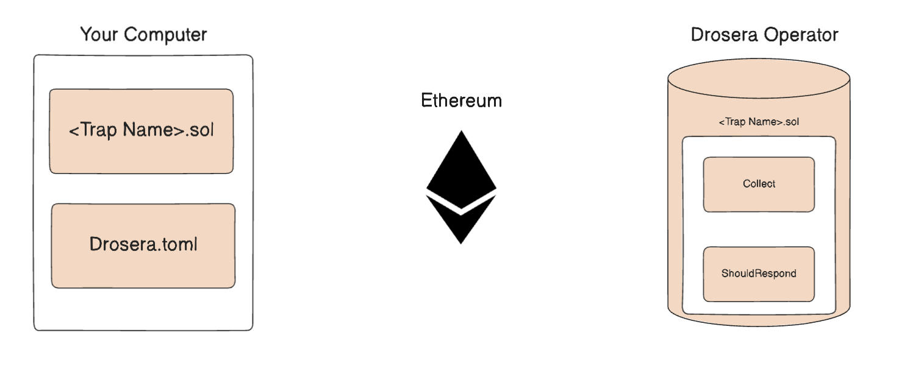
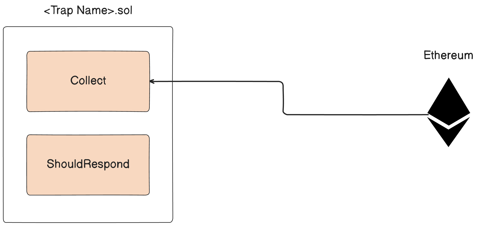
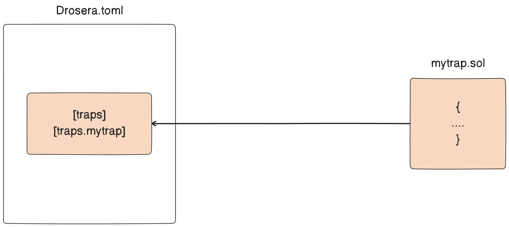
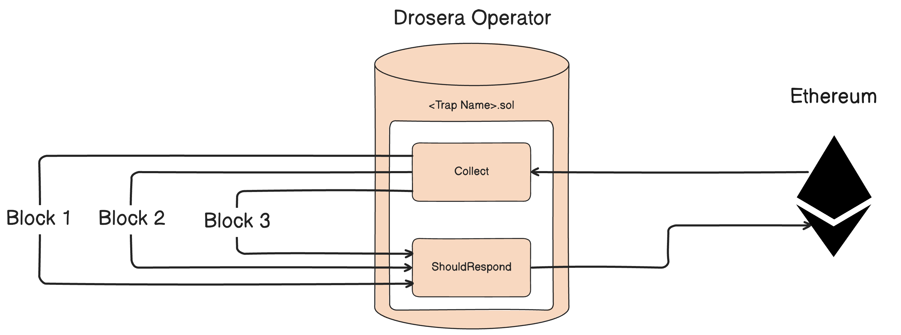
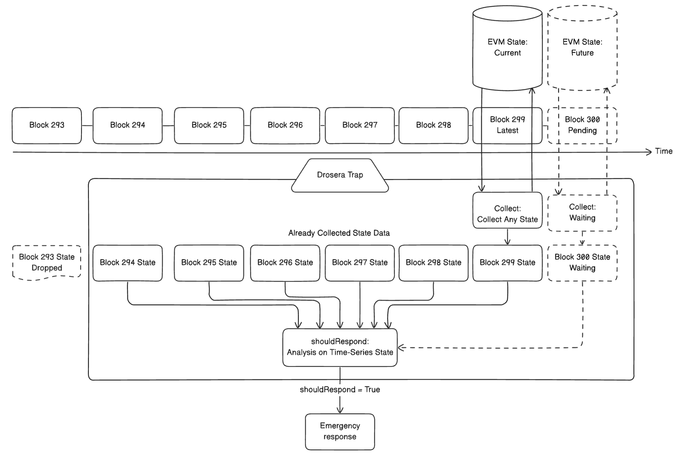
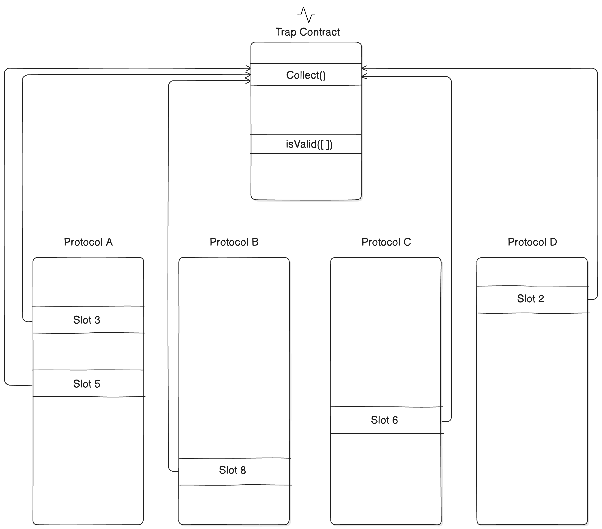
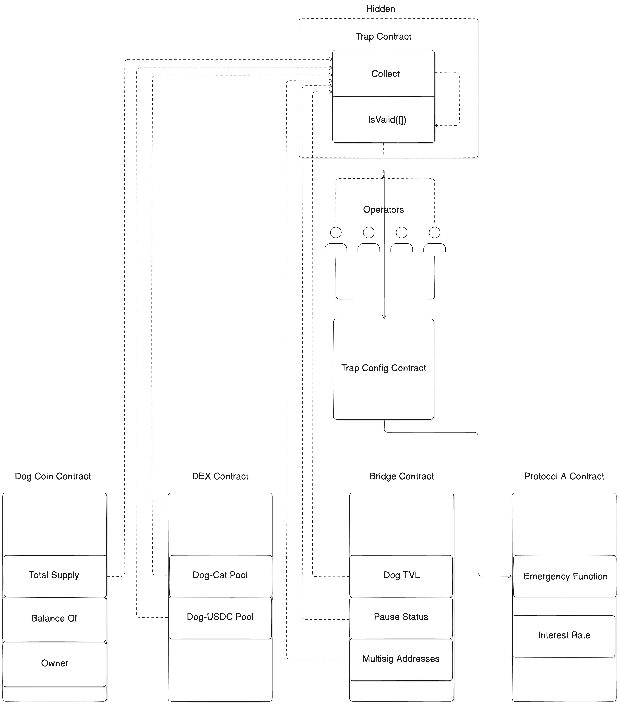

# Welcome to Trap Academy!

This introductory workshop will cover the basics of Traps, including its architecture and key concepts.

## Workshop Overview

Cover the following topics:

1. **Core Concepts**
2. **What is a Trap?**

## Core Concepts

There are 3 core concepts

- **Trap Solidity File**
- **Drosera.toml File**
- **Drosera Operator**



### Trap Solidity File

The Trap logic is written in Solidity.

https://dev.drosera.io/trappers/creating-a-trap#trap-anatomy



### Drosera.toml File

The Trap configuration file.

https://dev.drosera.io/trappers/drosera-cli#droseratoml



### Drosera Operator

The Drosera node(s) that run the Trap logic.

https://dev.drosera.io/operators/run-operator#run-the-drosera-operator-node-



### Core Concepts: Conclusion

A `drosera.toml` configures a Trap

Traps `Collect` data every block

An `Operator` determines whether it `ShouldRespond` on-chain based on the `Collect` data

## What is a Trap?



### Trap collection



### The whole picture



## Conclusion

If you want to start building with Traps, you need to:

1. Write a Trap Solidity file
2. Create a `drosera.toml` file
3. Run a Drosera Operator

Luckily, we have built these files for you in the following workshops!

You simply need to install the Drosera CLI

```bash
curl -L https://app.drosera.io/install | bash
```

## Resources

https://www.youtube.com/@youtube.DROSERA

https://dev.drosera.io/

https://github.com/drosera-network/examples

https://app.42agents.ai/drosera/drosera
